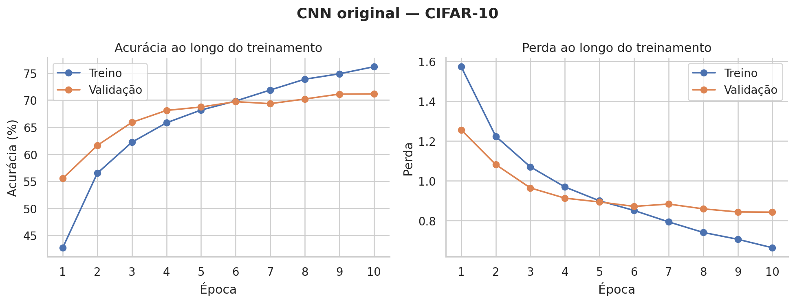
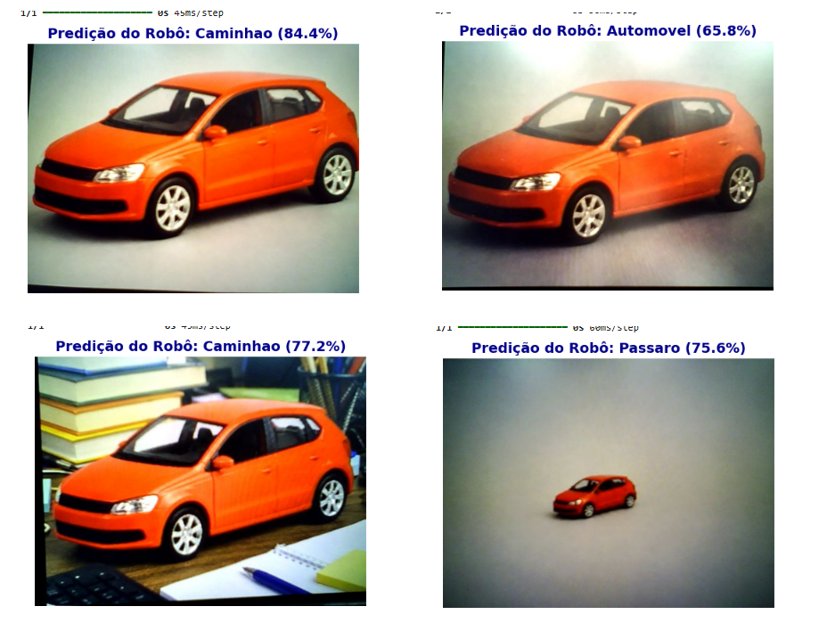

# ESZA019 — Laboratório 7: Introdução às CNNs

Relatório do Grupo 2 para a disciplina ESZA019 — Visão Computacional, da Universidade Federal do ABC.

**Autores:** Cesar de Jesus, Mariana Chiara e Vinicius de Marchi  
**Docente:** Prof. Celso Setsuo Kurashima  
**Realização e publicação:** 29 de julho de 2026

## Relatório

O relatório completo, com fundamentação, códigos, respostas, resultados, limitações e declaração de uso de IA, está em:

- [Relatorio_Lab7_Grupo2.ipynb](Relatorio_Lab7_Grupo2.ipynb)

## Resumo dos resultados

| Etapa | Resultado principal |
|---|---|
| CNN original | 76,17% no treino e 71,15% no teste |
| Matriz de confusão | 7.115 acertos em 10.000 imagens |
| Maiores falsos positivos | classes preditas cervo (513) e gato (391) |
| Webcam — condição normal | caminhão, 84,4% |
| Webcam — iluminação alterada | automóvel, 65,8% |
| Webcam — fundo complexo | caminhão, 77,2% |
| Webcam — objeto distante | pássaro, 75,6% |
| CNN com aumento de dados | melhor validação de 64,75% em 10 épocas |
| Limite de confiança | 4 de 10 imagens rejeitadas abaixo de 60% |





[Vídeo-resumo dos testes com webcam](assets/video_resumo_webcam.mp4)

O vídeo é uma sequência das quatro capturas estáticas e não uma filmagem contínua.

## Como reproduzir

1. Abra o notebook no Google Colab.
2. Em `Tempo de execução → Alterar tipo de ambiente de execução`, escolha a GPU T4.
3. Execute as células na ordem.
4. Autorize o acesso à webcam quando o navegador solicitar.

As figuras numéricas também podem ser recriadas localmente:

```bash
python gerar_figuras_lab7.py
```

## Estrutura

```text
Lab7_Grupo2/
├── Relatorio_Lab7_Grupo2.ipynb
├── README.md
├── requirements.txt
├── gerar_figuras_lab7.py
└── assets/
    ├── figuras dos experimentos
    ├── estímulos apresentados à webcam
    └── video_resumo_webcam.mp4
```

## Uso de IA

Ferramentas de IA generativa da OpenAI foram usadas como apoio na depuração, organização do código, revisão da redação e criação dos quatro estímulos padronizados do automóvel. Treinamento, capturas, métricas, análise e validação foram realizados pelo grupo. A declaração completa está no relatório.
