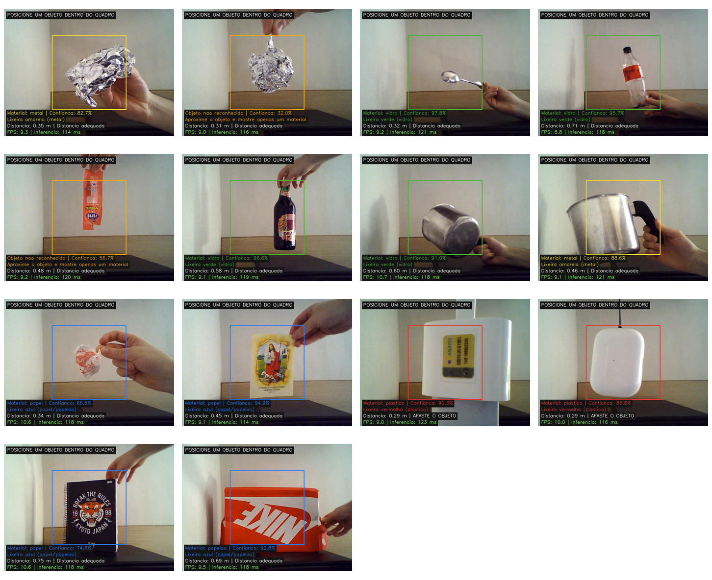
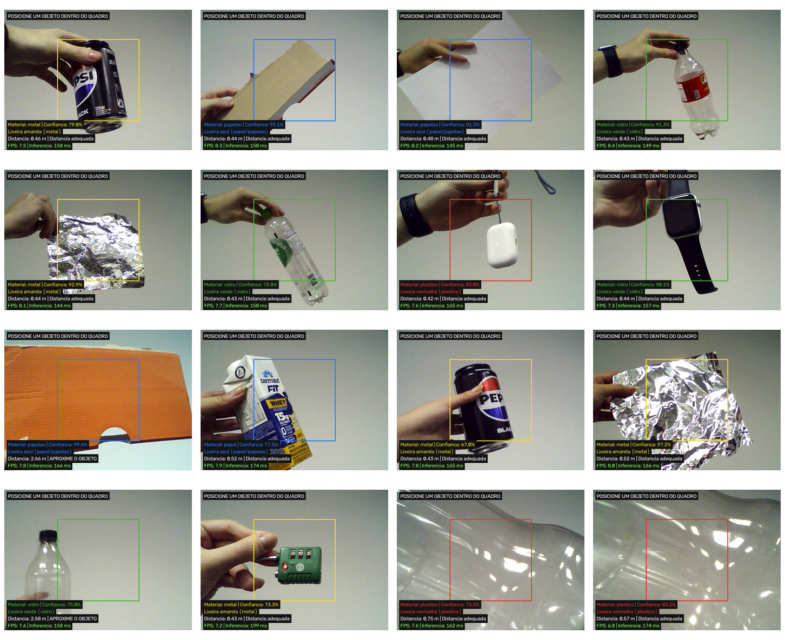

# Etapa 6 — Relatório dos testes voluntários

**Disciplina:** Visão Computacional — CV 2026.2  
**Projeto:** Robô classificador de materiais recicláveis  
**Grupo 2:** Cesar de Jesus, Mariana Chiara e Vinicius de Marchi  
**Data dos testes voluntários:** 10 de agosto de 2026  
**Data do relatório:** 12 de agosto de 2026

## 1. Objetivo

Esta etapa teve como objetivo avaliar o funcionamento e a usabilidade do sistema desenvolvido pelo Grupo 2. O projeto utiliza duas câmeras e técnicas de visão computacional para detectar um objeto, estimar sua distância, classificar o material predominante e indicar a cor da lixeira correspondente.

O teste buscou verificar:

- se participantes externos conseguiam compreender e utilizar o sistema;
- se as informações exibidas eram claras e úteis;
- se a classificação funcionava com objetos diferentes dos exemplos usados durante o desenvolvimento;
- quais erros e limitações apareciam em condições reais de uso.

## 2. Metodologia

O teste voluntário foi realizado em sala de aula com **sete participantes**, pertencentes a outros grupos da disciplina. Para preservar a privacidade, eles são identificados neste relatório apenas como **V1 a V7**.

Cada voluntário posicionou diferentes objetos dentro da região indicada na imagem. O sistema analisou o objeto em tempo real e apresentou:

- material previsto;
- confiança da classificação;
- cor da lixeira recomendada;
- distância estimada;
- orientação para aproximar ou afastar o objeto, quando necessário;
- taxa de quadros por segundo e tempo de inferência.

Após a utilização, cada participante respondeu a um formulário. Os itens 1 a 10 correspondem à escala **System Usability Scale (SUS)**, com respostas de 1 a 5. O item 11 avaliou diretamente a interatividade, enquanto os itens 12 a 17 reuniram comentários abertos sobre a experiência e os resultados.

Além dos testes em sala, foram analisadas **14 capturas realizadas anteriormente em ambiente doméstico**, permitindo comparar o comportamento do modelo em dois contextos diferentes.

## 3. Avaliação de usabilidade

### 3.1 Cálculo da escala SUS

O SUS foi calculado da forma convencional:

1. nos itens positivos (1, 3, 5, 7 e 9), foi subtraído 1 da resposta;
2. nos itens negativos (2, 4, 6, 8 e 10), a resposta foi subtraída de 5;
3. as dez contribuições foram somadas e multiplicadas por 2,5.

O resultado é uma pontuação de 0 a 100. Ela **não representa uma porcentagem de acertos**, mas uma medida padronizada da percepção de usabilidade.

| Participante | Pontuação SUS | Interatividade (1–5) |
|---|---:|---:|
| V1 | 85,0 | 3 |
| V2 | 100,0 | 5 |
| V3 | 100,0 | 4 |
| V4 | 100,0 | 4 |
| V5 | 100,0 | 5 |
| V6 | 100,0 | 5 |
| V7 | 95,0 | 5 |
| **Média** | **97,1** | **4,4** |

A pontuação média de **97,1/100** ficou muito próxima do valor máximo da escala. A mediana foi 100, cinco dos sete participantes obtiveram pontuação 100 e a menor pontuação individual foi 85. Esses resultados mostram uma percepção muito positiva de facilidade de uso, integração das funções, rapidez de aprendizagem e confiança durante a interação.

### 3.2 Médias dos itens do questionário

| Item | Afirmação resumida | Média |
|---:|---|---:|
| 1 | Gostaria de usar o sistema com frequência | 5,00 |
| 2 | Sistema desnecessariamente complexo | 1,00 |
| 3 | Sistema fácil de usar | 4,86 |
| 4 | Necessidade de suporte técnico | 1,43 |
| 5 | Funções bem integradas | 4,71 |
| 6 | Existência de inconsistências | 1,00 |
| 7 | Aprendizagem rápida pela maioria das pessoas | 4,86 |
| 8 | Sistema complicado de usar | 1,00 |
| 9 | Confiança ao utilizar o sistema | 4,86 |
| 10 | Necessidade de aprender muitas coisas antes do uso | 1,00 |
| 11 | Sistema interativo | 4,43 |

Os itens positivos ficaram próximos de 5 e os itens negativos próximos de 1. A principal exceção foi o item 4: um participante marcou a opção 3 e outro marcou 2, sugerindo que uma instrução inicial curta ainda pode ajudar alguns usuários.

## 4. Resultados dos testes de classificação

### 4.1 Testes anteriores em ambiente doméstico

Foram examinadas 14 capturas cujos nomes registravam o objeto testado e o resultado esperado. Em **9 casos**, a saída foi compatível com o material esperado; em **3 casos**, houve classificação incorreta; e em **2 casos**, o objeto não foi reconhecido. A taxa observada nessa pequena amostra foi, portanto, de **9/14 (64,3%)**.

| Objeto ou situação | Resultado do sistema | Avaliação |
|---|---|---|
| Papel-alumínio | Metal — 82,7% | Correto |
| Papel-alumínio amassado | Não reconhecido — 32,0% | Falha de detecção |
| Colher metálica | Vidro — 97,8% | Incorreto |
| Garrafa PET | Vidro — 95,7% | Incorreto |
| Embalagem estreita | Não reconhecida — 56,7% | Falha de detecção |
| Garrafa de vidro | Vidro — 96,6% | Correto |
| Panela metálica | Vidro — 91,0% | Incorreto |
| Panela metálica | Metal — 88,6% | Correto em outra posição |
| Papel amassado | Papel — 66,5% | Correto |
| Folheto | Papel — 94,9% | Correto |
| Dois objetos plásticos | Plástico — 90,3% e 86,8% | Corretos |
| Caderno | Papel — 74,6% | Correto |
| Caixa | Papelão — 92,8% | Correto |

Os testes mostram que a pose e a forma de apresentação do objeto influenciam o resultado. Isso aparece claramente na panela, que foi classificada primeiro como vidro e depois corretamente como metal, e no papel-alumínio, reconhecido em uma configuração e rejeitado em outra.

### 4.2 Testes voluntários em sala

Nas 16 capturas registradas em sala, **13 resultados foram visualmente compatíveis com o material predominante apresentado**. As três ocorrências mais evidentes de ambiguidade foram duas garrafas PET classificadas como vidro e um relógio com tela classificado como vidro. Como os objetos em sala não foram registrados previamente com rótulos formais de referência, esse número deve ser interpretado como uma inspeção das capturas, e não como uma medição definitiva de acurácia.

Entre os exemplos reconhecidos de forma adequada estavam latas e papel-alumínio como metal, papel e caixas como papel/papelão, estojo plástico como plástico e uma garrafa de vidro como vidro. Plásticos transparentes apresentados isoladamente também foram classificados corretamente em duas capturas.

### 4.3 Distância e desempenho

O módulo estéreo também apresentou comportamento coerente durante os testes. Na maior parte das capturas, os objetos estavam entre aproximadamente **0,42 m e 0,75 m**, faixa indicada como adequada. Quando o objeto estava muito longe, o sistema exibiu a orientação **“APROXIME O OBJETO”**; quando estava muito próximo, exibiu **“AFASTE O OBJETO”**.

Em sala, foram observadas taxas aproximadas entre **6,8 e 8,4 FPS**, com tempos de inferência entre **144 e 199 ms**. Nos testes domésticos, os valores ficaram aproximadamente entre **8,8 e 10,7 FPS**, com inferência entre **114 e 133 ms**. Assim, o sistema conseguiu manter resposta visual contínua nos dois ambientes, embora com desempenho um pouco menor no computador utilizado em sala.

## 5. Análise dos comentários dos voluntários

As respostas abertas reforçaram os resultados quantitativos. Os pontos mais elogiados foram:

- simplicidade de uso;
- proposta considerada criativa, útil e adequada a um projeto futuro;
- indicação da cor da lixeira;
- classificação apresentada de maneira clara;
- possibilidade de uso educativo, inclusive para ensinar crianças sobre reciclagem;
- identificação correta da maioria dos objetos experimentados.

As principais limitações e sugestões foram:

- dificuldade momentânea de identificação em alguns casos;
- necessidade de uma instrução inicial curta;
- confusão entre vidro e plástico transparente;
- ampliação da base de dados;
- apresentação e melhor tratamento da confiança do modelo.

Um comentário resumiu bem a principal dificuldade técnica observada: **a acurácia foi considerada muito boa, mas o plástico transparente ainda pôde ser confundido com vidro**.

## 6. Discussão

Os testes indicam que a interface e o fluxo de uso estão bem resolvidos. O usuário precisa apenas posicionar o objeto na região indicada e acompanhar as mensagens exibidas, o que explica a pontuação SUS elevada e as avaliações positivas de interatividade.

As limitações se concentraram principalmente no classificador. Materiais transparentes ou refletivos podem produzir aparências semelhantes nas imagens. Além disso, objetos como relógios, colheres revestidas e utensílios domésticos podem conter mais de um material, enquanto o modelo precisa selecionar somente uma classe. Esses fatores ajudam a explicar as confusões entre vidro, plástico e metal.

Outro ponto relevante é que alguns erros ocorreram com confiança alta: a colher foi classificada como vidro com 97,8%, a garrafa PET como vidro com 95,7% e a panela como vidro com 91,0%. Portanto, aumentar apenas o valor numérico de confiança não resolveria o problema. É necessário melhorar a diversidade da base de treinamento e avaliar a calibração das probabilidades produzidas pelo modelo.

## 7. Melhorias propostas

Com base nos testes, as próximas melhorias recomendadas são:

1. ampliar a base de treinamento com mais exemplos de plástico transparente, vidro, metal refletivo e objetos em diferentes posições;
2. incluir variações de iluminação, fundo, distância e enquadramento;
3. acrescentar uma classe de “objeto desconhecido” ou usar um limiar mais conservador antes de aceitar a classificação;
4. combinar resultados de vários quadros consecutivos, reduzindo oscilações momentâneas;
5. inserir uma instrução inicial curta diretamente na interface;
6. criar um conjunto de teste com rótulos definidos previamente e calcular matriz de confusão, precisão, revocação e acurácia por classe;
7. tratar separadamente objetos compostos por vários materiais.

## 8. Limitações da avaliação

O teste contou com uma amostra pequena de sete voluntários, todos ligados à mesma disciplina. Os objetos utilizados em sala não formaram um conjunto padronizado e algumas classificações foram avaliadas visualmente a partir das capturas. Além disso, a avaliação registrou momentos específicos do vídeo, e não toda a sequência temporal de cada tentativa. Por isso, os resultados devem ser entendidos como uma validação inicial de usabilidade e funcionamento, e não como uma medição definitiva do desempenho estatístico do classificador.

## 9. Conclusão

O teste voluntário confirmou que o robô classificador de materiais recicláveis é simples, interativo e facilmente compreendido. A pontuação SUS média de **97,1/100** e a média de interatividade de **4,4/5** demonstram uma experiência de uso muito positiva.

O sistema reconheceu corretamente diversos exemplos de metal, papel, papelão, plástico e vidro, além de informar a distância e a lixeira recomendada em tempo real. Os erros observados se concentraram em materiais visualmente semelhantes, especialmente plástico transparente e vidro, e em objetos refletivos ou compostos por vários materiais.

Assim, a proposta foi validada pelos voluntários tanto em utilidade quanto em usabilidade. As avaliações também forneceram uma direção clara para trabalhos futuros: ampliar e diversificar os dados, melhorar o tratamento de previsões incertas e realizar uma validação quantitativa com conjunto de teste controlado.

---

### Arquivos complementares

- [`dados_questionarios.csv`](dados_questionarios.csv): respostas anonimizadas e cálculo individual do SUS;
- [`imagens/testes_casa.jpg`](imagens/testes_casa.jpg): conjunto visual dos testes domésticos;
- [`imagens/testes_sala.jpg`](imagens/testes_sala.jpg): conjunto visual dos testes voluntários em sala.
